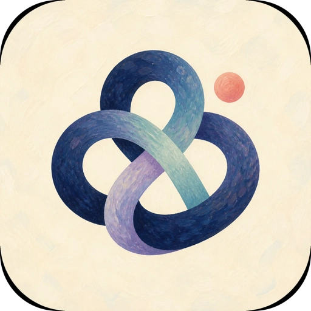
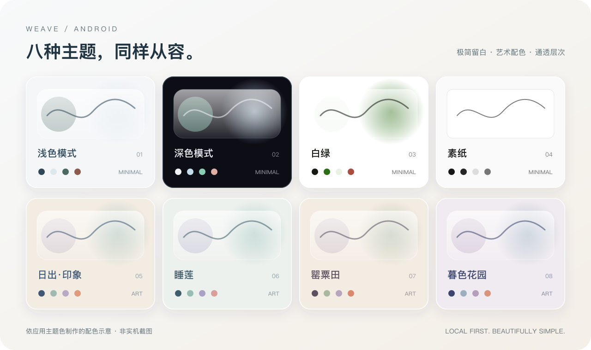

  

<h1 align="center">Weave</h1>

让代理更好看，也更好用。

A beautiful, local-first Android proxy client.

  <a href="https://github.com/sundaysebasidian-byte/weave-client/releases/tag/v0.3.0-alpha77">下载 Android</a> ·
  <a href="docs/BUILD_ANDROID.md">构建指南</a> ·
  <a href="PRIVACY.md">隐私说明</a> ·
  <a href="https://github.com/sundaysebasidian-byte/weave-client/issues">反馈问题</a>

*配色展示图，非实机截图。四种极简、四种艺术风；素纸主题采用平整设计。*

## 简洁，不简单

- **八种主题，赏心悦目。** 清爽极简与莫奈灵感艺术配色，搭配 Liquid Glass 风格的通透层次。喜欢克制，也有轻巧的黑白素纸。
- **图形化分流，一眼看懂。** 先选应用，再选订阅和节点；代理、直连或阻止，去向清楚，上手简单。
- **本地优先，隐私自主。** 无 Weave 账号、云端后台或遥测上报。订阅与凭据在本机加密保存，不建立云端访问记录。
- **持续维护，定期迭代。** 持续改善兼容性、稳定性和使用体验；通过 GitHub 发布更新，由你决定何时升级。
- **网络与隐私检测，一个入口。** 查看出口 IP、连接延迟、探测失败率及常用网站可达性，检查 WebRTC 与浏览器身份暴露；明确区分检测证据、未知项和外部核验。
- **迁移方便，分享可控。** 支持 CMFA、Clash、Karing 等客户端的兼容文件、链接和二维码导入；局域网快速分享时，自选要分享的订阅。

## 八种风格，随心选择

**极简风**：浅色模式 · 深色模式 · 白绿 · 素纸

**艺术风**：日出·印象 · 睡莲 · 罂粟田 · 暮色花园

支持简体中文、繁體中文、English、日本語、Français、Deutsch。

## 开始使用

1. 从 [Release](https://github.com/sundaysebasidian-byte/weave-client/releases/tag/v0.3.0-alpha77) 下载 APK。现代 Android 手机通常选择 **ARM64**。
2. 导入你已有的订阅，选择订阅与节点。
3. 按需设置应用分流，确认系统 VPN 授权后连接。

Weave 不提供、销售或推荐节点。支持 Clash/Mihomo YAML、JSON、URI/Base64，以及兼容的 sing-box / 基础 V2Ray 配置；不代表支持所有客户端的专有备份或全部配置扩展，也不会读取其他应用的私有数据。

当前版本为 **0.3.0-alpha77 预发布版**，适用于 Android 8.0 及以上。请保留可用配置，覆盖安装前查看 Release 中的签名与升级说明。

## 隐私，说清楚

本地优先不等于绝对匿名。订阅、代理节点、DNS 和检测服务由第三方提供，仍可能看到完成请求所需的信息；主动检测也会连接相应服务。HTTP 探测失败率不等于底层数据包丢失，网站可达不等于账号或流媒体解锁。DNS 泄漏需结合独立服务核验，不用一个“安全分数”代替证据。

了解 [隐私政策](PRIVACY.md)、[网络端点清单](docs/NETWORK_ENDPOINT_INVENTORY.md) 与 [安全反馈方式](SECURITY.md)。

## 开源与共建

欢迎通过 [Issues](https://github.com/sundaysebasidian-byte/weave-client/issues) 提交问题与建议。请先删除日志和截图中的订阅地址、密码、IP 与其他私人信息。

基于 CMFA / Mihomo，感谢上游与所有开源贡献者。Weave 与 CMFA、Karing 等项目没有官方关联。

[构建指南](docs/BUILD_ANDROID.md) · [更新记录](CHANGELOG.md) · [贡献指南](CONTRIBUTING.md) · [第三方说明](THIRD_PARTY.md)

采用 [GPL-3.0-or-later](LICENSE) 许可证。当前公开 Release 仅面向 Android。
