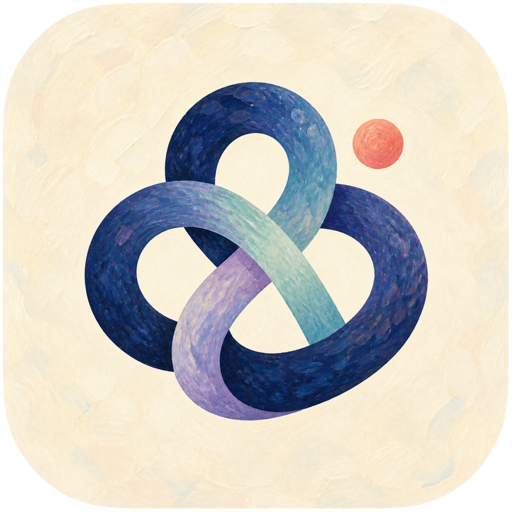
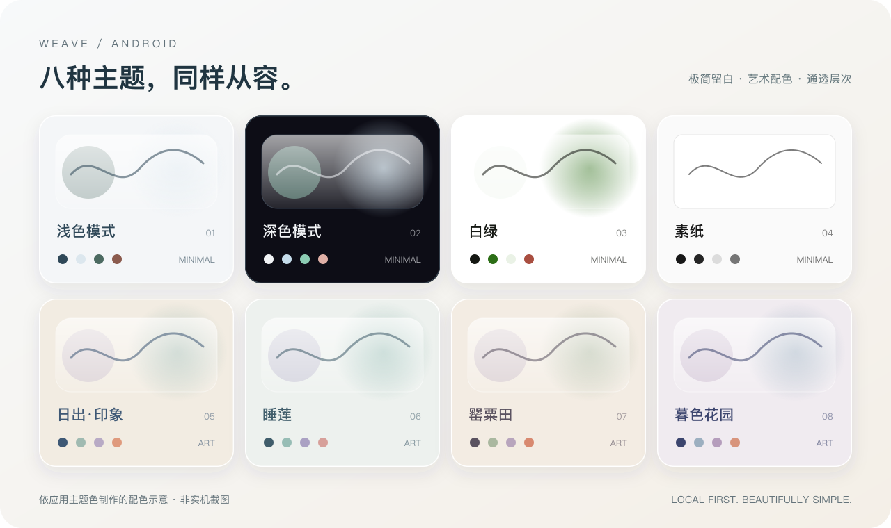
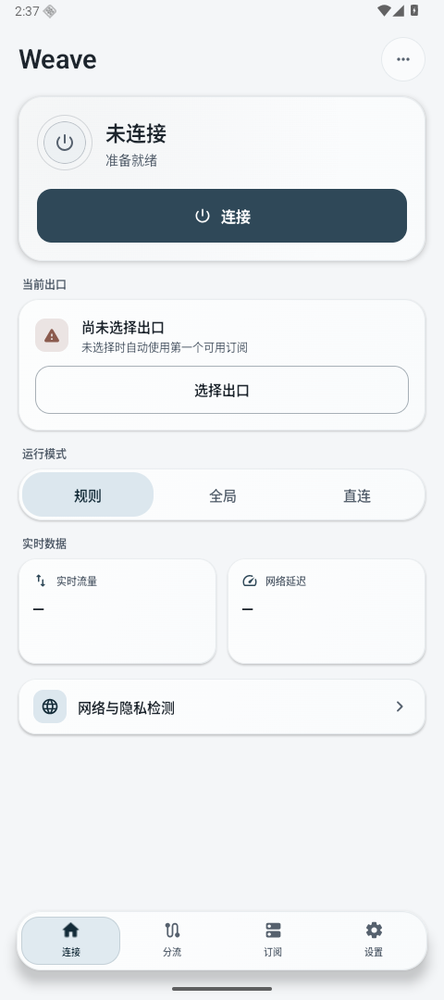
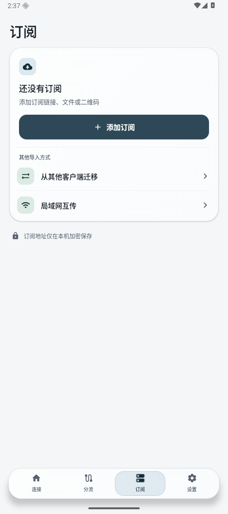
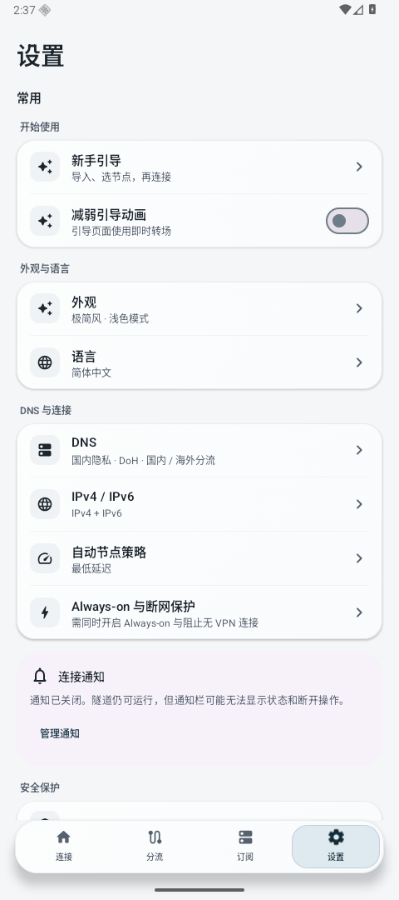
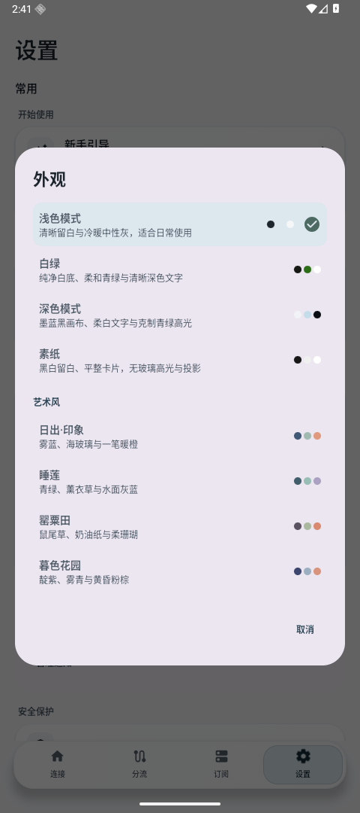
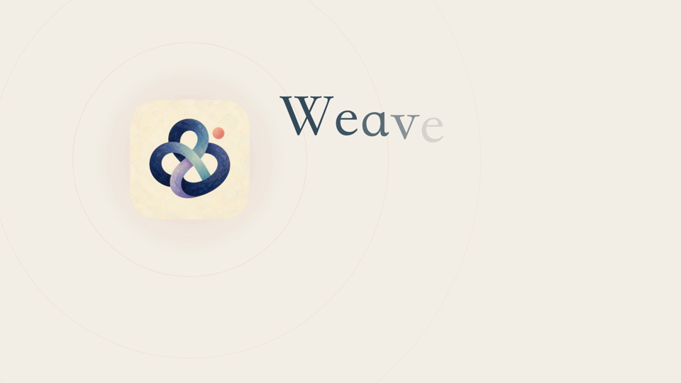

  

<h1 align="center">Weave</h1>

让代理更好看，也更好用。

A beautiful, local-first Android proxy client.

  <a href="https://github.com/sundaysebasidian-byte/weave-client/releases/tag/v0.4.0-rc4">下载公开测试版</a> ·
  <a href="docs/BUILD_ANDROID.md">构建指南</a> ·
  <a href="PRIVACY.md">隐私说明</a> ·
  <a href="https://github.com/sundaysebasidian-byte/weave-client/issues">反馈问题</a>

> **最新公开版本：0.4.0-rc4（Build 110）· Prerelease。** 生产签名，适用于 Android 8.0+ 的 ARM64 设备，尚未达到稳定版验收范围。验证范围见 [RC4 说明](docs/releases/v0.4.0-rc4.md)。
>
> **源码请按版本选择。** `main` 已整合 RC4 / Build 110 的代码及测试，并保留 main 的既有修复和最近文档。已发布 APK 的固定对应源码仍是 [`v0.4.0-rc4` 标签](https://github.com/sundaysebasidian-byte/weave-client/tree/v0.4.0-rc4)；复现公开包请使用该标签。后续 main 构建不自动成为已发布或已验收的二进制。

*配色展示图，非实机截图。四种极简、四种艺术风；素纸主题采用平整设计。*

## 简洁，不简单

- **八种主题，赏心悦目。** 清爽极简与莫奈灵感艺术配色，搭配 Liquid Glass 风格的通透层次。喜欢克制，也有轻巧的黑白素纸。
- **图形化分流，一眼看懂。** 先选应用，再选订阅和节点；代理、直连或阻止，去向清楚，上手简单。
- **本地优先，隐私自主。** 无 Weave 账号、云端后台或遥测上报。订阅与凭据在本机加密保存；自选第三方服务仍会接收完成请求所需的信息。
- **持续维护，定期迭代。** 持续改善兼容性、稳定性和使用体验；通过 GitHub 发布更新，由你决定何时升级。
- **网络与隐私检测，一个入口。** 查看出口 IP、连接延迟、探测失败率及常用网站可达性，检查 WebRTC 与浏览器身份暴露；明确区分检测证据、未知项和外部核验。
- **迁移方便，分享可控。** 支持 CMFA、Clash、Karing 等客户端的兼容文件、链接和二维码导入；局域网快速分享时，自选要分享的订阅。

RC4 新增可跳过、可从设置重开的三步引导；手动更新单个订阅时先预览节点变化，再确认保存。通过系统文件授权导入 CMFA 配置文档，或通过官方备份文件导入 Karing 订阅组；导入兼容节点的本地快照，不迁移原订阅 URL、路由或 DNS 设置。

## 八种风格，随心选择

**极简风**：浅色模式 · 深色模式 · 白绿 · 素纸

**艺术风**：日出·印象 · 睡莲 · 罂粟田 · 暮色花园

支持简体中文、繁體中文、English、日本語、Français、Deutsch。

## 界面与宣传片

### RC4 真实界面

以下四张来自 **0.4.0-rc4 / Build 110 的原生产签名 APK**，在独立 Android 模拟器的空数据环境中截取，图片未修改。展示简体中文界面，不含真实订阅、节点凭据或 IP，也不代表已连接 VPN。

<table>
  <tr><th>连接页</th><th>订阅管理 · 空状态</th></tr>
  <tr>
    <td></td>
    <td></td>
  </tr>
  <tr><th>设置</th><th>外观选择</th></tr>
  <tr>
    <td></td>
    <td></td>
  </tr>
</table>

### 原宣传片 · 20 秒

[查看视频文件](docs/media/weave-original-cg.mp4) · [下载原 MP4](https://raw.githubusercontent.com/sundaysebasidian-byte/weave-client/main/docs/media/weave-original-cg.mp4)

保留已确认原片的画面、节奏和音轨，1920 × 1080、30 fps。它是历史品牌宣传素材，包含风格示意，当前 RC4 实际界面见上方截图。[素材版本与校验值](docs/media/PROVENANCE.json)。

## 开始使用

1. 从 [RC4 Release](https://github.com/sundaysebasidian-byte/weave-client/releases/tag/v0.4.0-rc4) 下载生产签名的 **ARM64** APK，核对附件校验和后安装。
2. 导入你已有的订阅，选择订阅与节点。
3. 按需设置应用分流，确认系统 VPN 授权后连接。

Weave 不提供、销售或推荐节点。支持 Clash/Mihomo YAML、JSON、URI/Base64，以及兼容的 sing-box / 基础 V2Ray 配置；不代表支持所有客户端的专有备份或全部配置扩展，也不会读取其他应用的私有数据。

### 升级前

公开 Build 106 使用开发证书，通常不能被 RC4 生产签名包直接覆盖；106 的数据迁移尚未验收。请先导出加密备份并确认可以解密恢复，不要通过卸载、清空数据或强制降级解决签名冲突。生产签名 RC107–RC110 使用同一证书，详见 [RC4 的签名与验证范围](docs/releases/v0.4.0-rc4.md)。

RC4 已完成既往回归及 Pixel 四项 UI 检查，真机确认保存、重装、VPN 流量、泄漏与耐久、OEM 全覆盖及 Windows 10/11 VPN 回滚仍未验收。其他平台源码存在不代表已通过验收。

## 隐私，说清楚

本地优先不等于绝对匿名。订阅、代理节点、DNS 和检测服务由第三方提供，仍可能看到完成请求所需的信息；主动检测也会连接相应服务。HTTP 探测失败率不等于底层数据包丢失，网站可达不等于账号或流媒体解锁。DNS 泄漏需结合独立服务核验，不用一个“安全分数”代替证据。

了解 [RC4 隐私说明](https://github.com/sundaysebasidian-byte/weave-client/blob/v0.4.0-rc4/PRIVACY.md)与[端点清单](https://github.com/sundaysebasidian-byte/weave-client/blob/v0.4.0-rc4/docs/NETWORK_ENDPOINT_INVENTORY.md)，或查看 [main 代码线的隐私说明](PRIVACY.md)及[安全反馈方式](SECURITY.md)。

## 开源与共建

欢迎通过 [Issues](https://github.com/sundaysebasidian-byte/weave-client/issues) 提交问题与建议。请先删除日志和截图中的订阅地址、密码、IP 与其他私人信息。

基于 CMFA / Mihomo，感谢上游与所有开源贡献者。Weave 与 CMFA、Karing 等项目没有官方关联。

[构建指南](docs/BUILD_ANDROID.md) · [更新记录](CHANGELOG.md) · [贡献指南](CONTRIBUTING.md) · [第三方说明](THIRD_PARTY.md)

采用 [GPL-3.0-or-later](LICENSE) 许可证。当前公开 Release 仅面向 Android；完整对应源码与第三方通知随 RC4 附件提供，GitHub 自动生成的源码 ZIP 不能替代完整对应源码包。
